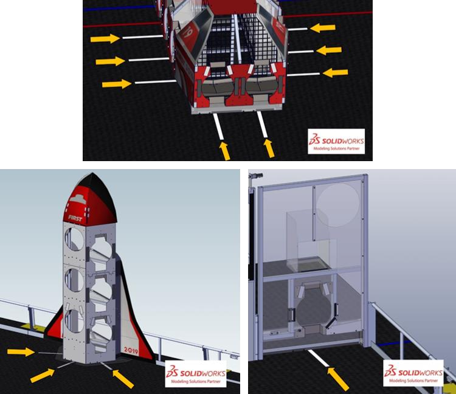

## ALIGNMENT LINE:
One of thirty-two (32) white gaffers tape marks adhered to the carpet that start 1 ft. 6
in. (~46 cm) from the outermost face of the assembly and extend to the point where the carpet meets the
assembly and centered at GAME PIECE placement/retrieval points. 

- one (1) ALIGNMENT LINE for each of the three (3) faces of each ROCKET
- one (1) ALIGNMENT LINE for each CARGO SHIP BAY
- one (1) ALIGNMENT LINE for each LOADING STATION

*Figure 4-5 ALIGNMENT LINES (three (3) places per ROCKET, eight (8) places per CARGO SHIP, and one (1) place per LOADING STATION)*
