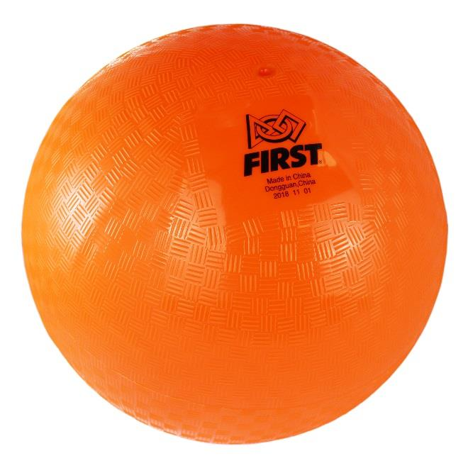

## 4.9.1 CARGO
Each CARGO is an orange 13-in. (~33 cm) rubber playground ball with a FIRST logo as shown in Figure
4-29. The ball is made by Sportime (PN 1623139E) and sold by AndyMark ([PN am-4000_cargo](http://www.andymark.com/2019cargo)). The
closest commercially available substitute, a red ball with no FIRST logo (same size and material), is
available at School Specialty (Sportime PN [1293618](https://www.schoolspecialty.com/playground-ball-1293618)).

>These playground balls used as CARGO are not manufactured with any tight tolerance.
They’re not balanced all the way around and wall thickness varies so they may not
always roll straight or bounce as expected.

*Figure 4-29 CARGO*