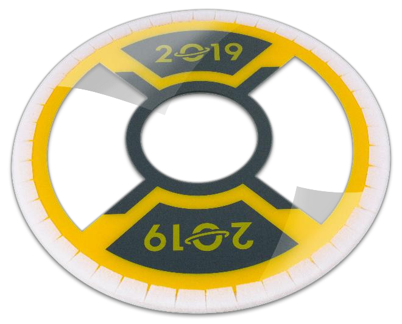

## 4.9.2 HATCH PANEL
Each HATCH PANEL is a circular 3 / 16 -in. (~5 mm) thick polycarbonate toroid. The outside diameter of the
toroid is 19 in. (~48 cm) and the diameter of the hole centered in the toroid is 6 in. (~15 cm) The edge and
outside ~1 in. (~3 cm) of both sides of the toroid are covered with white 3MTM Fastener SJ3571 loop tape
(PN 70070457349).

The HATCH PANELS that shipped in the Kickoff Kits and that will be used in official DESTINATION:
DEEP SPACE competitions are [VEXpro part number 217-6562](http://www.vexrobotics.com/217-6562.html). Due to sourcing complexities, most panel
inventory available for purchase uses a different, but functionally equivalent, loop tape.

*Figure 4-30 HATCH PANEL*