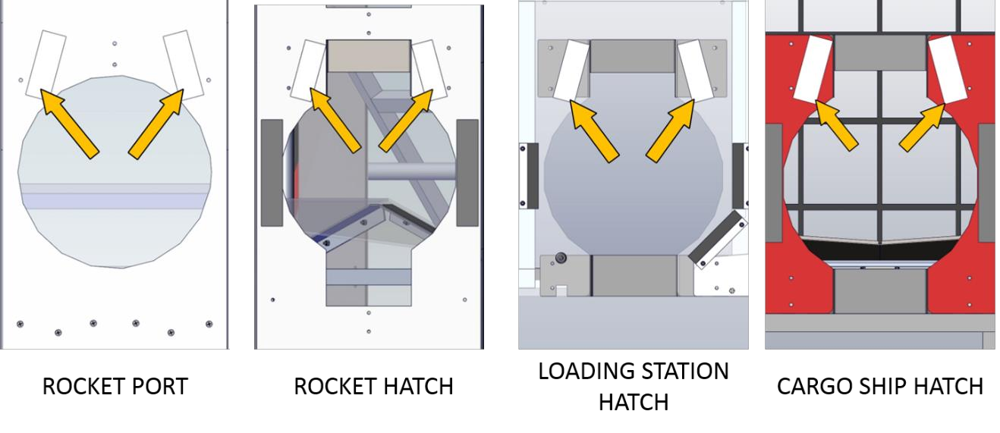

## 4.10 VISION TARGETS
Vision targets are located on the ROCKETS, CARGO SHIPS, and LOADING STATIONS and highlight
the locations of the HATCHES, PORTS, and HATCH PANEL retrieval locations. A vision target is a pair of
51⁄2 in. (~14 cm) long by 2 in. (~5 cm) wide strips of 3M 8830 Scotchlite Reflective Material. Strips areangled toward each other at ~14.5 degrees and such that there’s an 8-in. (~20 cm) gap at their closest
points.

Vision targets on the “front” face of the ROCKET highlight the top of the lowest PORT and are 3 ft 31⁄8 in.
(~99 cm) above the carpet at their highest point.

Vision targets on the “side” faces of the ROCKET highlight the location of the top of the lowest HATCH
and are 2 ft 71⁄2 in. (~80 cm) above the carpet at their highest point (the same height as the top of the
HATCH opening).

Vision targets also highlight the locations of the tops of each CARGO SHIP HATCH and the tops of each
LOADING STATION HATCH (at the same height as the ROCKET HATCH targets).

*Figure 4-31 Vision targets*
